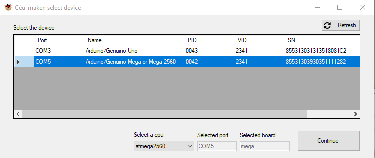

# Céu-Maker: easy-to-install, up-to-date integrated environment for Céu-Arduino and pico-Céu development
Céu-Maker is a programming environment that integrates Céu-Arduino and pico-Céu in a single package for Windows. The project already existed before Google Summer of Code 2018, but lacked documentation and examples of use, and required too much work from developers to generate a new release. Also, some features needed improvement.

Céu-Maker integrates 4 repositories, and the work done during the Google Summer of Code were added in the ```pre-v0.40``` branch:
- Céu: https://github.com/ceu-lang/ceu/tree/pre-v0.40
- Céu-Arduino: https://github.com/ceu-lang/ceu-arduino/tree/pre-v0.40
- pico-Céu: https://github.com/ceu-lang/pico-ceu/tree/pre-v0.40
- Céu-Maker: https://github.com/ceu-lang/ceu-maker/tree/pre-v0.40

The Céu-Maker version developed in Google Summer of Code can be found in [Céu-Maker releases page](https://github.com/ceu-lang/ceu-maker/releases).

Next, we will present the contributions to Céu-Maker, explaning the motivation and implementation.

## Automate the generation of a new release of Céu-Maker
To create a new release of Céu-Maker, developers needed to manually clone the repositories, checkout the target version for each of them and use a Makefile to copy the needed folders to the release. They also needed to:
- do some configuration in the Makefile (edit ```Makefile.dirs``` to point to the source repositories);
- download third-party binaries if the command ```make``` was not available on Windows (which was generally the case);
- manually use WinRAR to generate a self-extracting executable.

Now, changes in Makefile are no longer necessary, make binary was included in Céu-Maker repository and the WinRAR process was automated. The developer only need to execute a single command using GitBash, that is normally available to anyone who uses Git on Windows.

## Allow user to select a board during Céu-Arduino compilation
Now the user can select the Arduino board and port using Céu-Maker. We developed a GUI application (located in [/SelectDevice](SelectDevice)) that, when the user compiles a source code, list all the connected Arduino boards and allow the user to select one. 



## Tutorial to integrate Visual Studio Code with Céu-Maker
We created a short tutorial to explain how to add an option in Visual Studio Code to compile Céu source code without leaving the code editor. The tutorial can be accessed [here](/VSCode%20with%20Céu-Maker). It seems like will be possible to install the VSCode without privileges ([check the discussion here](https://github.com/Microsoft/vscode/issues/534#issuecomment-384580829)). When this become a reality, the Notepad++ could be replaced.

## Pico-Céu API for serial ports (Usart)
A pico-Céu API to facilitate the use of serial communication. It was basead on the [Céu-Arduino Usart API](https://github.com/ceu-arduino/driver-usart) so that the user could use the same API in both enviroments. The API can be checked in [/ceu-lang/pico-ceu/include/usart.ceu](https://github.com/ceu-lang/pico-ceu/blob/pre-v0.40/include/usart.ceu).

## Code examples with explanation
During the GSoC we developed the following tutorials:
- [race.ceu](https://github.com/ceu-lang/pico-ceu/tree/pre-v0.40/examples/race): a pico-Céu game used to explain features of pico-Céu, such as graphical draw, sound, parallel compositions and window configuration;
- [race-frames](https://github.com/ceu-lang/pico-ceu/tree/pre-v0.40/examples/race-frames): how to develop the race game using frame features;
- [move-net](https://github.com/ceu-lang/pico-ceu/tree/pre-v0.40/examples/move-net): in this example we explain how to use Céu NETWORK features creating a distributed version of [move.ceu example](https://github.com/ceu-lang/pico-ceu/blob/pre-v0.40/examples/move.ceu), in which a user of one instance of the application can movement a white pixel around the window and a user from the other instance can control a green one;
- [echo-usart](https://github.com/ceu-lang/ceu-maker/tree/pre-v0.40/ceu-maker/examples/both/echo-usart): demonstrate the use of ```usart``` API. In this example, the pico-Céu application receives a message from an Arduino connected via serial port and send it back, working as an echo server.


