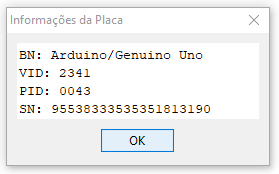

# Add a new Arduino board to Céu-Maker
This tutorial currently refears to Céu-Maker Windows version, and propose a solution to when a connected AVR Arduino board is not listed by Céu-Maker.

First of all, check if you can compile an ```.ino``` code using the Arduino IDE located at ```ceu-maker/arduino-1.8.3```.

If everything works fine, open the Arduino IDE and select ```Tools > Get Board Info```. If the board name is not presented at the ```Board Info``` pop-up, you can solve the problem by:

- Opening the file ```ceu-maker/arduino-1.8.3/hardware/arduino/avr/boards.txt```;
- Locating the informations related to your board. Arduino UNO informations, for example, are prefixed by ```uno.```, Arduino nano, by ```nano.``` and so on.
- After the ```.name```, add the VID and PID informations. Check the Arduino Nano example:
```
nano.name=Arduino Nano

nano.vid.0=0x1A86
nano.pid.0=0x7523
```
The 1A86 and 7523 are the numbers displayed on the ```Board Info``` pop-up:


The 0 before the ```=``` is a sequencial number. If a board need to have more than VID and PID combination, this number is simply increased. Take a look at Arduino Uno informations.
```
uno.name=Arduino/Genuino Uno

uno.vid.0=0x2341
uno.pid.0=0x0043
uno.vid.1=0x2341
uno.pid.1=0x0001
uno.vid.2=0x2A03
uno.pid.2=0x0043
uno.vid.3=0x2341
uno.pid.3=0x0243
```

## VID and PID
> A USB device that is plugged in identifies itself by its VID/PID combination. A VID is a 16-bit vendor number (Vendor ID). A PID is a 16-bit product number (Product ID).

This is how the Céu-Maker identifies informations about a connected board, by the PID and VID combination. With this combination, Céu-Maker look in ```ceu-maker/arduino-1.8.3/hardware/arduino/avr/boards.txt``` file for information about a board that have the VID and PID combination.

## Links
- [How to obtain an USB VID/PID for your project](https://www.voti.nl/docs/usb-pid.html)